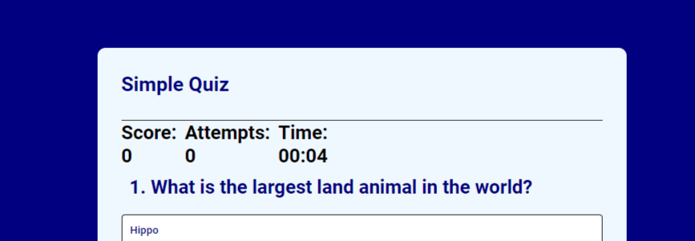

<h1>Quiz Game</h1>
The Quiz game is a simple general knowledge quiz that tracks your Score, attempts and time.
<h2>Features</h2>

    <ul>  
        <li>Rules</li>
        <ul>
                <li>Shows as soon as the page is loaded</li>
                <li>After ready button is clicked rules will dissapear to give a better user experience</li>
        </ul>
    </ul>
    
    <ul>        
    <li>Ready Button</li>
        <ul>
            <li>Starts the Quiz and the timer</li>
            <li>Hides the rules when clicked</li>
        </ul>
    </ul>
    

    <ul>
        <li>Next Button</li>
        <ul>
            <li>CHeck to see if the answer the user submitted is correct or not</li>
            <li>Depending on the answer the score or attempts will be increased accordingly</li> 
        </ul>
    </ul> 
    
    <ul>
        <li>Scores</li>
        <ul>
            <li>The total amount of correct answers the user has submitted is track and shown</li>
            <li>The total ammount of incorrect answers the user has tried to commit is tracked and show</li>
            <li>The next question will only show whenthe question is answered correct</li> 
        </ul>
    </ul>
    <ul>
        <li>Timer</li>
        <ul>
            <li>Timer starts as soon as the ready button is clicked</li>
            <li>The time it takes the user to  complete the quiz is tracked and logged to the console when finished</li>
        </ul>
    </ul>
    

    
    <ul>
        <li>End game message</li>
        <ul>
            <li>Congratulations message only shows when all answers are answered correctly</li>
        </ul>
    </ul>
    

<h2>Testing</h2>

<ul>
    <li>I tested that this page works  in different browsers:Opera GX, Microsoft edge, Chrome</li>
    <li>I confirmed that this project is responsive, looks good and functions on all different types of screen sizes using the devtools device toolbar</li>
    <li>I confirmed that the Html, Css and Javascript are all readable and easy to understand.</li>
    <li>I have confirmed that the Quiz works and cannot report any bugs as of now</li>
</ul>
<h3>Bugs</h3>
   
Solved bugs

   <ul>
       <li>Right and wrong answer increasing attemots score, problem when calling implementScore function</li>
       <li>Next button not taking you to the next question, it was a problem with the currentQuestionIndex</li>
    </ul>

<h3>Validator Testing</h3>
<ul>
    <li>HTML
    <ul>
        <li>No errors were returned when passing through the official W3C Validator</li>
    </ul>
    <ul>
    <li>CSS
    <ul>
        <li>No errors were returned when passing through the official (jigsaw) Validator</li>
    </ul>
    <li>JavaScript
    <ul>
        <li>No errors were returned when passing through JSHint, warning caused by formatting extention (prettier)</li>
    </ul>
    <li>Accessibility
    <ul>
        <li>I can connfirmed that the color and fonts chosen are easy to read and accessible by running it through lighthouse</li>
    </ul>
</ul>
<h3>Unfixed bugs<h3>
Warning in official W3c valadator, its says there isnt a header for the article but there is.
<h2>Deployment</h2>

<ul>
    <li>The site  was deplyed to GitHub pages. The steps to deploy are as follows:</li>
    <ul>
        <li>In the Github repository, navigate to Deployments (Should be on the right side of the page towards the bottom)</li>
        <li>After clicking on Deployments select the top link (Has the url of https://marble-frog.github.io/Quiz-Game/)</li>
    </ul>
<h2>Credits</h2>

